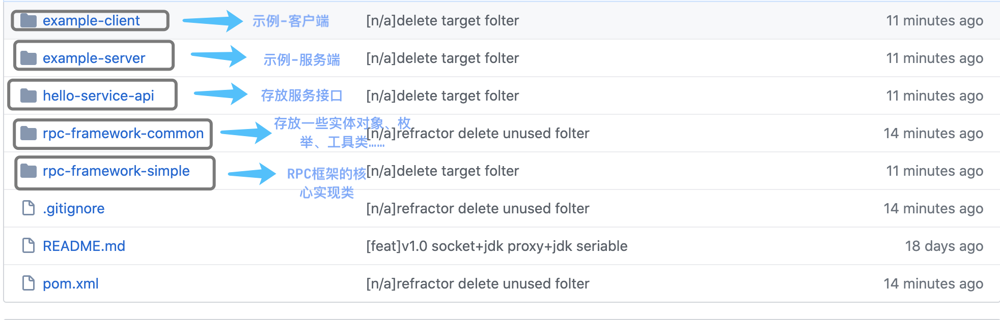

### 基本的 RPC 框架


一个简易的 RPC 框架使用示意图如下图所示：


### 项目模块概览


### 下载运行 zookeeper

这里使用 Docker 来下载安装。

下载：

```shell
docker pull zookeeper:3.5.8
```

运行：

```shell
docker run -d --name zookeeper -p 2181:2181 zookeeper:3.5.8
```

## 使用

### 服务提供端

实现接口：

```java
@Slf4j
@RpcService(group = "test1", version = "version1")
public class HelloServiceImpl implements HelloService {
    static {
        System.out.println("HelloServiceImpl被创建");
    }

    @Override
    public String hello(Hello hello) {
        log.info("HelloServiceImpl收到: {}.", hello.getMessage());
        String result = "Hello description is " + hello.getDescription();
        log.info("HelloServiceImpl返回: {}.", result);
        return result;
    }
}
	
@Slf4j
public class HelloServiceImpl2 implements HelloService {

    static {
        System.out.println("HelloServiceImpl2被创建");
    }

    @Override
    public String hello(Hello hello) {
        log.info("HelloServiceImpl2收到: {}.", hello.getMessage());
        String result = "Hello description is " + hello.getDescription();
        log.info("HelloServiceImpl2返回: {}.", result);
        return result;
    }
}
```

发布服务(使用 Netty 进行传输)：

```java
/**
 * Server: Automatic registration service via @RpcService annotation
 *
 * @author shuang.kou
 * @createTime 2020年05月10日 07:25:00
 */
@RpcScan(basePackage = {"github.ancientmoon.serviceimpl"})
public class NettyServerMain {
    public static void main(String[] args) {
        // Register service via annotation
        new AnnotationConfigApplicationContext(NettyServerMain.class);
        NettyServer nettyServer = new NettyServer();
        // Register service manually
        HelloService helloService2 = new HelloServiceImpl2();
        RpcServiceProperties rpcServiceConfig = RpcServiceProperties.builder()
                .group("test2").version("version2").build();
        nettyServer.registerService(helloService2, rpcServiceConfig);
        nettyServer.start();
    }
}
```

### 服务消费端

```java
@Component
public class HelloController {

    @RpcReference(version = "version1", group = "test1")
    private HelloService helloService;

    public void test() throws InterruptedException {
        String hello = this.helloService.hello(new Hello("111", "222"));
        //如需使用 assert 断言，需要在 VM options 添加参数：-ea
        assert "Hello description is 222".equals(hello);
        Thread.sleep(12000);
        for (int i = 0; i < 10; i++) {
            System.out.println(helloService.hello(new Hello("111", "222")));
        }
    }
}
```

```java
ClientTransport rpcRequestTransport = new SocketRpcClient();
RpcServiceProperties rpcServiceConfig = RpcServiceProperties.builder()
        .group("test2").version("version2").build();
RpcClientProxy rpcClientProxy = new RpcClientProxy(rpcRequestTransport, rpcServiceConfig);
HelloService helloService = rpcClientProxy.getProxy(HelloService.class);
String hello = helloService.hello(new Hello("111", "222"));
System.out.println(hello);
```

## 相关问题

### 为什么要造这个轮子？Dubbo 不香么？

写这个 RPC 框架主要是为了通过造轮子的方式来学习，检验自己对于自己所掌握的知识的运用。

实现一个简单的 RPC 框架实际是比较容易的，不过，相比于手写 AOP 和 IoC 还是要难一点点，前提是你搞懂了 RPC 的基本原理。

我之前从理论层面在我的知识星球分享过如何实现一个 RPC。不过理论层面的东西只是支撑，你看懂了理论可能只能糊弄住面试官。咱程序员这一行还是最需要动手能力，即使你是架构师级别的人物。当你动手去实践某个东西，将理论付诸实践的时候，你就会发现有很多坑等着你。

大家在实际项目上还是要尽量少造轮子，有优秀的框架之后尽量就去用，Dubbo 在各个方面做的都比较好和完善。

### 如果我要自己写的话，需要提前了解哪些知识

**Java** ：

1. 动态代理机制；
2. 序列化机制以及各种序列化框架的对比，比如 hession2、kyro、protostuff。
3. 线程池的使用；
4. `CompletableFuture` 的使用
5. ......

**Netty** ：

1. 使用 Netty 进行网络传输；
2. `ByteBuf` 介绍
3. Netty 粘包拆包
4. Netty 长连接和心跳机制

**Zookeeper** :

1. 基本概念；
2. 数据结构；
3. 如何使用 Netflix 公司开源的 zookeeper 客户端框架 Curator 进行增删改查；

## 教程

Guide 的星球正在更新《从零开始手把手教你实现一个简单的 RPC 框架》。扫描下方二维码关注“**JavaGuide**”后回复 “**星球**”即可。


